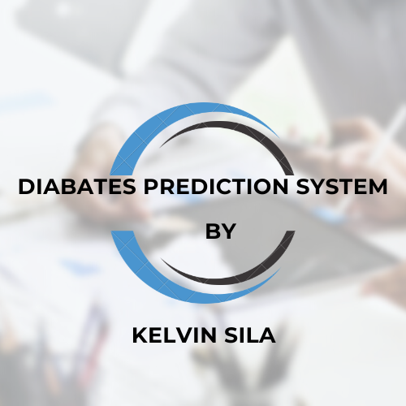
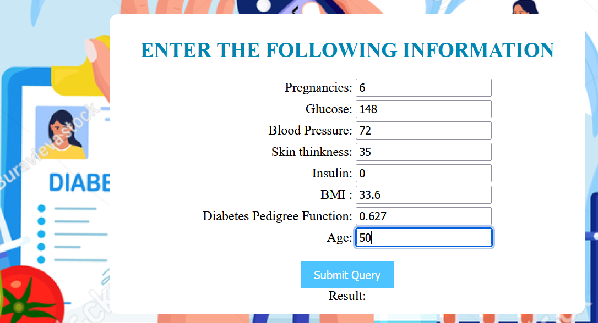
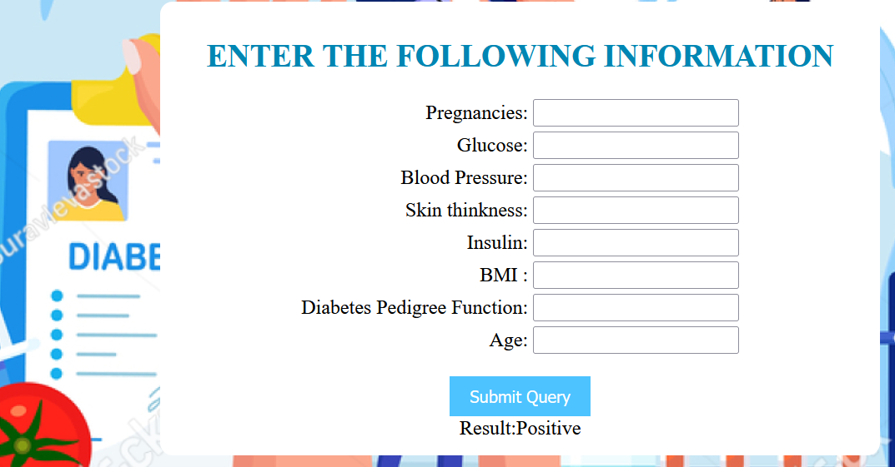
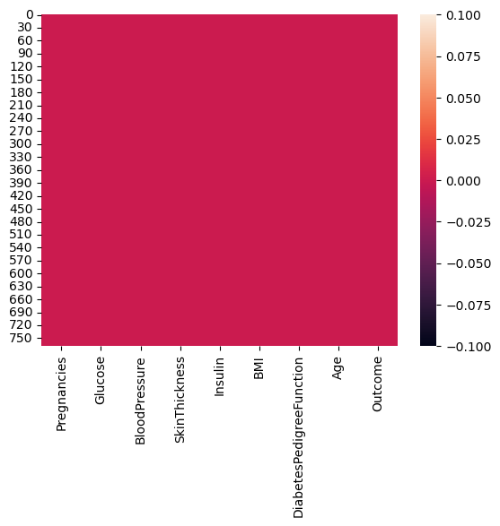
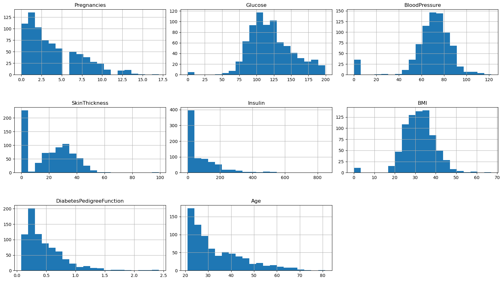
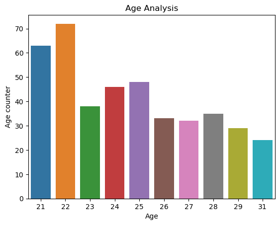
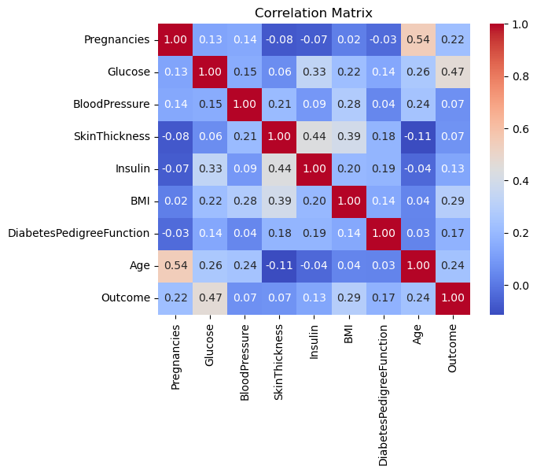

# Diabetes Prediction System
***

  

***

  

  

 ***
### Contents
- [Business Understanding](#businessunderstanding)
- [Problem Statement](#problemstatement)
- [Data Understanding](#dataunderstanding)
- [Recommendations](#recommendations)

  ***
  ## Business Understanding
  The goal of this machine learning project is to develop a diabetes prediction system using logistic regression. This system will help in early identification of individuals who may be at risk of developing diabetes based on certain health-related features. The deployment will be done through a Django web application, providing a user-friendly interface for individuals to input their health data and receive predictions regarding their likelihood of being diabetic.

  ***
  ## Problem Statement
  Diabetes is a prevalent and serious health condition, and early detection is crucial for effective management and prevention of complications. The objective is to create a reliable and accessible tool that can predict the likelihood of an individual having diabetes based on key health indicators. By deploying this system, we aim to contribute to proactive health management and promote early intervention.

  ***
  ## Data Understanding

* The dataset contains data suitable for predictive analysis.
* To derive predictions from the given dataset, the data is partitioned into independent and dependent variables.
* Upon analysis, I observed that all seven variables i.e. Pregnancies, Glucose, Blood pressure, skin thickness, Insulin, BMI , Diabetes, Age are independent, while 'Outcome' serves as the dependent variable.
* From the given dataset, 0 represents that the person is not diabetic and 1 shows that the person is diabetic.

  ***
  **heatmap for the features**
  

  ***
  **Feature Distribution**
  

  ***
  **Age Analysis**
  

  ***
  **Corrrelations**

  

 ***
 ### Summary of the Models
*Logistic Regression:
** Accuracy: 75.32%
Logistic regression demonstrated the highest accuracy among the evaluated models. It is a suitable choice for the diabetes prediction system, providing a reliable method for distinguishing between diabetic and non-diabetic individuals.
* K-Nearest Neighbors (KNN):
* Accuracy: 65.58%
KNN showed a lower accuracy compared to logistic regression. While KNN can be effective in certain scenarios, its performance in this context indicates that the logistic regression model is better suited for the diabetes prediction task.
* Random Forest:
*Accuracy: 70.78%
Random Forest performed reasonably well, but its accuracy was lower than that of the logistic regression model. It could be considered for further exploration or ensemble methods, but the logistic regression model is recommended as the primary choice based on the provided results.
* Naive Bayes:
* Accuracy: 72.73%
Naive Bayes demonstrated competitive accuracy. Its performance is closer to logistic regression, suggesting it could be an alternative model for consideration. Further experimentation and comparison with logistic regression may help in making the final model selection.

    ***

##Recommendations

* Deploy the Logistic Regression model: Given its highest accuracy, logistic regression is recommended as the primary model for the diabetes prediction system. It has shown effectiveness in distinguishing between diabetic and non-diabetic cases based on the provided health-related variables.

* Sensitivity Analysis: Perform sensitivity analysis on the logistic regression model to understand the impact of individual features on predictions. This can provide insights into the importance of each variable in identifying potential diabetic cases.
* Model Interpretability: Enhance model interpretability by providing clear explanations of how the logistic regression model makes predictions. This can contribute to user trust and understanding.
 

    

 
  

  

